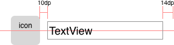
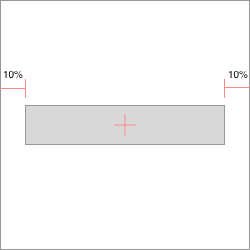
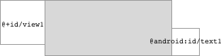

# FlexLayout

The idea is simple, use java expressions in layout params like `layout_left="view1.right+10dp"`. It is helpful when LinearLayout and RelativeLayout is not enough for you.

	<TextView
		app:layout_left="icon.right+10dp"
		app:layout_right="100%-14dp"
		app:layout_centerY="icon.centerY"
		android:layout_height="wrap_content"
		.../>

Try the sample apk: [FlexLayout.apk](imgs/FlexLayout.apk)

## Layout Params

|   Horizontal   |    Vertical    |
| -------------- | -------------- |
| layout_left    | layout_top     |
| layout_right   | layout_bottom  |
| layout_centerX | layout_centerY |
| layout_width   | layout_height  |

Remember the `app:layout_width` is different from `android:layout_width` *xmlns:app="http://schemas.android.com/apk/res-auto"*

## % Percentage

	<Button
		app:layout_left="10%"
		app:layout_right="10%"
		app:centerY="50%"
		android:layout_height="wrap_content"
		../>

or

	<Button
		app:layout_width="80%"
		app:centerX="50%"
		app:centerY="50%"
		android:layout_height="wrap_content"
		../>

## Reference other views

Reference previous view using `prev`, next view using `next`

	<View
		app:layout_left="prev.right"
		app:layout_right="next.left"
		app:layout_top="prev.top"
		app:layout_bottom="next.bottom" />

Reference a specific view using `view's id`

	<View
		app:layout_left="view1.right"
		app:layout_right="android:text1.left"
		app:layout_top="view1.top"
		app:layout_bottom="android:text1.bottom" />

You can also use `parent` to reference the FlexLayout and `this` to reference the child view itself. Use `screen` to reference screen size. (**screen**, **parent**, **this** only support *width* and *height* property.)

| Properties |            |
| ---------- | ---------- |
| left       | top        |
| right      | bottom     |
| centerX    | centerY    |
| width      | height     |
| visible    | gone       |
| *tag       |            |

`view.visible`: view.getVisibility() == View.VISIBLE

`view.gone`: view.getVisibility() == View.GONE

`view.tag`: view.getTag(). Use View.setTag() to set a Number or Boolean and call View.requestLayout() to trigger layout. Types other than Number and Boolean returns 0.

## Expression

The syntax is the same as Java or C. Numbers can have units like `10dp`, `15sp`

	(parent.height-view1.centerY)/2
	100%-80dp
	max(view1.right, view2.right)
	screen.width<screen.height ? 64dp : 48dp
	view1.visible && view2.visible ? max(view1.bottom, view2.bottom) : 0px

Operators (Order in precedence)

| Operator    | Associativity |
| ----------- |:-------------:|
| () sp dp dip px pt mm in | Right |
| !           | Right         |
| * / %       | Left          |
| + -         | Left          |
| <= < >= >   | Left          |
| == !=       | Left          |
| &&          | Left          |
| ll          | Left          |
| ?=          | Right         |

Functions

| Name        |
| ----------- |
| max(a,b)    |
| min(a,b)    |
| round(a)    |
| ceil(a)     |
| floor(a)    |
| abs(a)      |
| mod(a)      |
| pow(a)      |

